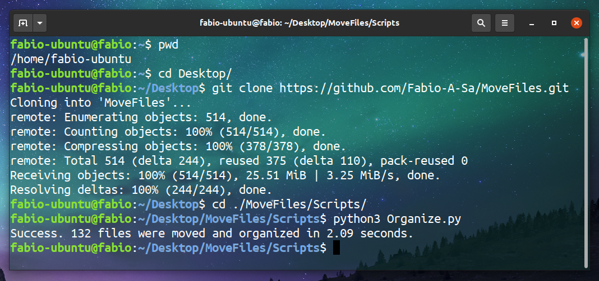

# MoveFiles for Windows and Linux

<p align="center">
  
</p>


## Prerequisites

You need to install the Python extension and all dependences:

```
Python 3.X                              <-- Python3
pip install Pillow                      <-- Installing a Python Imaging Library
```


## Running

To run a script, in Linux or Windows, call the script inside a folder with photos using terminal.

```
git clone https://github.com/Fabio-A-Sa/MoveFiles.git
cd .\MoveFiles\Scripts\
python3 Organize.py
```
<p align="center">
  
</p>


## Motivation for script development

Since I am involved in an activity that implies the manipulation of hundreds of photos and other files, the [Geocaching](https://www.geocaching.com/play/search), I needed to implement a Python script to streamline the photo selection and sharing process. Therefore, uploading to my gallery on the official hobby website, which already has more than 25,000 photos, becomes faster. <br/>
Besides that, the fact that I am responsible for dozens of websites spread across Portugal and Spain, which require HTML, JavaScript and CSS, made this project increased to the ``.html`` ``.js`` and ``.css`` extensions in addition to those already implemented ``.jpg`` ``.png`` ``.jpeg`` ``.py`` ``.cpp``  and  ``.txt`` files. Manually, the user can add other extensions.

<br/>


# Fundamentals and features

### Metadata and exif

An image (downloading from the internet or taking photo with your phone) always contains important information about its creation - the metadata - which can be accessed through the Python Pillow (PIL) library.

```
from PIL import Image

photo = Image.open("elephant.png")
exif = photo._getexif()

exif = {
          37377: 7.149, 
          36867: '2020:10:18 12:33:53',                 <--- Creation Date
          36868: '2021:02:06 01:05:42',                 <--- Modification Date
          37378: 2.27,                                  <--- Focal Distance
          40961: 1, 
          40962: 3120,                                  <--- Number of pixels (vertical)
          40965: 850, 
          37522: '951268', 
          40963: 4160,                                  <--- Number of pixels (horizontal)
          41495: 2, 
          271: 'HUAWEI',                                <--- Brand of smarthphone that taken a photo
          283: 72.0, 
          34850: 2,
          41987: 0, 
          305: 'ATU-L21 8.0.0.151(C33)', 
          306: '2020:10:18 12:33:53',                   <--- Last Access Date
          41994: 0, 
          272: 'ATU-L21',                               <--- Camera Model
       }
```
To evaluate a photograph it was necessary to use the ```key "36867"``` and to evaluate a download ```key "36868" ```. <br/>
To evaluate other types of files:

```
import os
from datetime import datetime

date = datetime.fromtimestamp(os.path.getmtime(file))    <-- Modification date
date = datetime.fromtimestamp(os.path.getctime(file))    <-- Creation date
```

### Recursive Search

Often the files to be sorted are not only in the main directory but inside folders. Recursively, this method allows you to search the files for all folders and subfolders in the directory and pull them into the main directory. It is as if all the files containing the desired extensions jump out of the box. These are then pushed into the final folders. By default this option is active but can be easily changed either on the flag or using the manualSettings option.
```
import os
import glob
import shutil

all_directories = glob.glob( main_directory + "/**/*.{}".format(extension), recursive = True )
for file in all_directories:
    shutil.move(file, os.getcwd())
```

### Clean empty folders

When moving files using recursion, many of the folders may be empty. Thus, in order to remove the trash from the directory, a function is also recursively applied that eliminates all unused folders.

```
folders = sorted(list(os.walk(pwd))[1:], reverse = True)
for folder in folders:

    try:
        os.rmdir(folder[0])

    except OSError as error: 
        print("Directory '{}' can not be removed".format(folder[0])) 
```

### Backup files

In order not to interfere with the original organization of the directory, this feature creates and moves a copy of all files within the folders to the main directory. These are then pushed into the final folders. This function is disabled by default.

### Logs

This feature allows the visualization of all paths traced by the script. Records, in a notepad, the time the file was moved, the name, type and current location.

<p align="center">
  
</p>


<br/>

## License

This project is licensed under the [MIT License](https://github.com/Fabio-A-Sa/Photo-Organizer/blob/main/Licence).<br/>
<br/>
@ Fábio Araújo de Sá <br/>
2020/2021
